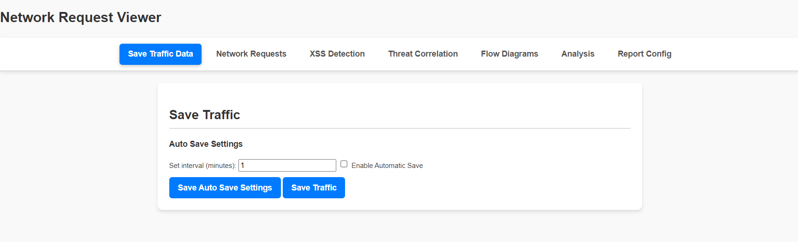

# HAR Data Viewer Extension

## Overview
The **HAR Data Viewer** is a Chrome Developer Tools extension designed for comprehensive network analysis for the purpose of digital forensics. It captures HTTP Archive (HAR) data, analyzes network traffic, identifies potential vulnerabilities (like XSS and MITM attacks), and detects malicious activities. The extension also offers interactive visualizations and customizable reporting.

---

## Features

### 1. Save Traffic Data

- **Manual Save**: Save captured network requests as a HAR file manually.
- **Automatic Save**: Automatically save HAR data at regular intervals.
  - Customizable save intervals.
  - File timestamps adjusted to Singapore timezone (GMT+8).

---

### 2. Network Requests Viewer

- **Search & Filter**: Search and filter network requests by:
  - URL
  - HTTP method
  - Status code
  - Timestamp
- **Detailed Insights**:
  - View headers, body, and timing details for each request.
  - Expand or collapse entries for better readability.

---

### 3. XSS Detection

- **Real-Time Detection**: Monitors for Cross-Site Scripting (XSS) patterns in requests and responses.
- **Pattern Matching**: Detects XSS patterns such as:
  - Inline JavaScript (`<script>`)
  - `eval()` calls
  - `document.cookie` access
  - Event handlers (e.g., `onclick` attributes)
- **Results Display**: Interactive table showing detected XSS issues.

---

### 4. Threat Correlation

- **Malicious IP Detection**:
  - Compares captured traffic against a list of known malicious IPs.
  - Displays alerts and request details for flagged connections.
- **Dynamic Alerts**:
  - Expandable malicious IP entries with associated request methods and URLs.

---

### 5. Flow Diagrams

- **Top Connections**:
  - Visualizes the most frequent source-to-destination connections.
  - Bar chart showing top connections based on request counts.

- **Traffic Over Time**:
  - Line graph showing network traffic volume over time.
  - Manual and auto-refresh options available.

---

### 6. Timing Analysis

- **Timing Anomalies**:
  - Identifies slow DNS resolution, connection, or request processing times.
  - Detects potential MITM attacks based on configurable timing thresholds.
- **Alerts**: Generates warnings for requests exceeding thresholds.

---

### 7. Report Generation

- **Customizable Reports**:
  - Include selected sections:
    - Network Requests Summary
    - XSS Detection Results
    - Malicious IPs
    - Flow Diagram Data
    - MITM Analysis
- **HTML Export**: Download a detailed HTML report.

---

## Installation
1. Clone or download the repository.
2. Open Chrome and navigate to `chrome://extensions/`.
3. Enable **Developer mode**.
4. Click **Load unpacked** and select the extension folder.

---

## Usage
1. Open Chrome Developer Tools (`Ctrl+Shift+I` or `F12`).
2. Switch to the **HAR Data Viewer** panel.
3. Navigate through the tabs:
   - **Overview**: Save and manage traffic data.
   - **Network Requests**: View and filter captured network requests.
   - **XSS Detection**: Detect potential XSS vulnerabilities.
   - **Threat Correlation**: Analyze malicious connections.
   - **Flow Diagrams**: Visualize request patterns and traffic data.
   - **Analysis**: Review timing anomalies for potential threats.
   - **Report Config**: Generate a detailed network analysis report.

---

## Dependencies
- **D3.js**: Library for creating visualizations in Flow Diagrams.
- **Chrome DevTools API**: For capturing network requests and inspecting page data.

---

## Main File Structure
- `panel.html`: User interface layout for the extension.
- `panel.js`: Implements core functionalities, including data capture, analysis, and reporting.
- `libs/d3.v7.js`: Library for visualizations.
- `data/malicious_ips.txt`: Preloaded list of malicious IPs for threat detection.

---
